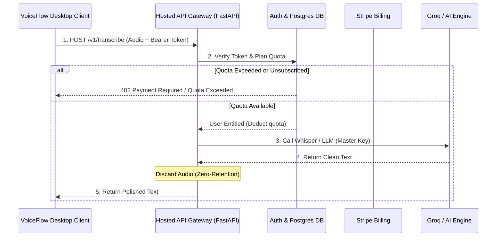
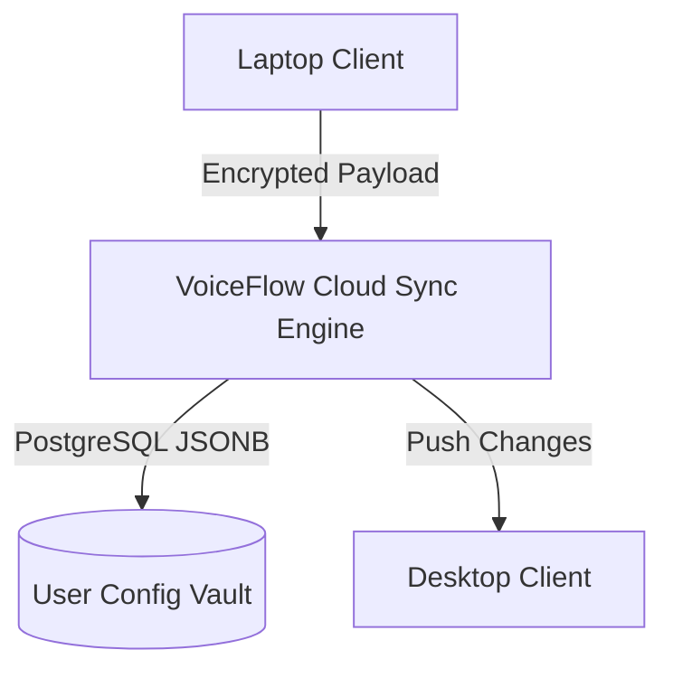
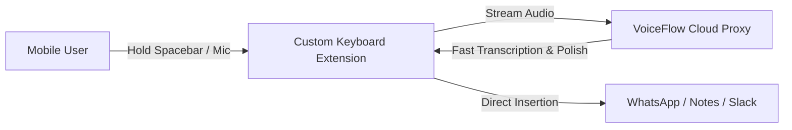

# VoiceFlow — Engineering Roadmap & Multi-Agent Progress Tracker

> **Context:** This document serves as the single source of truth for ongoing development across different AI coding agents (**Antigravity** and **Codex**).  
> **Current Version:** `3.2.1`  
> **Primary Platform:** Windows 10/11 (with cross-platform support for macOS & Linux, followed by Cloud, Teams & Mobile)

---

## 📌 Executive Progress Overview

_Last reviewed against the code: 2026-10-01 (branch `fix/review-findings`)._

```
[DONE] — 5 phases
  ✅ DONE  Step 1: Phase 1 — Modular Architecture & State Machine (Decomposed monolith, single-instance mutex)
  ✅ DONE  Step 2: Phase 3 — Desktop Experience (System Tray, Interactive Onboarding, In-App Updater)
  ✅ DONE  Step 3: Phase 4 — Live Overlay & Hands-Free Mode (Toggle Mode, Silence Auto-Stop, Esc-to-Cancel)
           (optional "live interim text preview" was not built)
  ✅ DONE  Step 5: Phase 6 — Application-Aware Writing (per-app settings are provided by Phase 8 profiles)
  ✅ DONE  Step 6: Phase 8 — Writing Profiles per App & Learning from Corrections

[PARTLY DONE] — 1 phase
  🟡 PARTLY  Step 4: Phase 5 — Voice Edit
             Done: voice edit on selected text, undo (tray menu), skipped in terminals/code editors/Excel
             Left: password-field protection

[LEFT — NOT STARTED] — 4 phases
  ⏳ TODO  Step 7: Phase 9 — Accounts, Cloud AI Proxy & Payments (Auth, Stripe, Quota & Zero-Retention Proxy)
  ⏳ TODO  Step 8: Phase 10 — Cross-Device Synchronization (Offline-First Sync for Vocabulary, Snippets & Profiles)
  ⏳ TODO  Step 9: Phase 11 — Team Features (Workspaces, Shared Dictionaries, Centralized Billing & Roles)
  ⏳ TODO  Step 10: Phase 12 — Mobile Apps (Native iOS Keyboard Extension & Android Input Method Editor)
```

> Note: this roadmap has no Phase 2 or Phase 7; the numbering skips them.

---

## 🏆 COMPLETED WORK: Steps 1, 2 & 3 (Steps 5 and 6 are marked DONE in their own sections below)

### 1. Phase 1: Modular Architecture & State Machine — ✅ DONE
* **Decomposed Monolith (`dictation_agent.py`):**
  * Reduced from an unmaintainable 1,345-line file into a clean ~550-line orchestrator.
  * Extracted core domain services into `voiceflow_core/`:
    * [`voiceflow_core/audio.py`](file:///c:/Users/waliq/Desktop/VoiceFlow/VoiceFlow/voiceflow_core/audio.py): `AudioCapture` class managing PyAudio stream, watchdog thread, rolling buffer, and RMS volume calculation.
    * [`voiceflow_core/hotkeys.py`](file:///c:/Users/waliq/Desktop/VoiceFlow/VoiceFlow/voiceflow_core/hotkeys.py): `normalize_key()`, modifier maps (`alt`, `ctrl`, `shift`, `cmd`), `hotkey_signature()`, and `repair_preset_conflicts()`.
    * [`voiceflow_core/clipboard.py`](file:///c:/Users/waliq/Desktop/VoiceFlow/VoiceFlow/voiceflow_core/clipboard.py): Cross-platform clipboard backup/restore, modifier key force-releasing with pynput `Controller`, and typing simulation.
    * [`voiceflow_core/overlay.py`](file:///c:/Users/waliq/Desktop/VoiceFlow/VoiceFlow/voiceflow_core/overlay.py): Tkinter-based floating HUD with GIF animation states (`listening`, `processing`, `ai_edit`, `notification`, `error`) and volume metering.
    * [`voiceflow_core/transcription.py`](file:///c:/Users/waliq/Desktop/VoiceFlow/VoiceFlow/voiceflow_core/transcription.py): `TranscriptionService` providing lazy-loaded local Faster-Whisper and Groq Whisper cloud API.
    * [`voiceflow_core/llm.py`](file:///c:/Users/waliq/Desktop/VoiceFlow/VoiceFlow/voiceflow_core/llm.py): `LLMService` managing Groq API completions (`openai/gpt-oss-20b`) and local Ollama (`llama3`) for grammar polish and contextual replies.
    * [`voiceflow_core/safe_logging.py`](file:///c:/Users/waliq/Desktop/VoiceFlow/VoiceFlow/voiceflow_core/safe_logging.py): Safe console logging utility that suppresses sensitive user dictation content.
* **Single-Instance Mutex Protection:**
  * Created [`voiceflow_core/single_instance.py`](file:///c:/Users/waliq/Desktop/VoiceFlow/VoiceFlow/voiceflow_core/single_instance.py) utilizing native Windows `CreateMutexW` (and file-locking on POSIX).
  * Prevents duplicate instances from crashing port 5000 or intercepting hotkeys. If launched again, it focuses the running window via `user32.SetForegroundWindow` and exits.

### 2. Phase 3: Desktop Experience & Onboarding — ✅ DONE
* **System Tray Integration ([`voiceflow_core/tray.py`](file:///c:/Users/waliq/Desktop/VoiceFlow/VoiceFlow/voiceflow_core/tray.py)):**
  * Integrated `pystray` and `Pillow`. Added hidden imports in [`build.py`](file:///c:/Users/waliq/Desktop/VoiceFlow/VoiceFlow/build.py).
  * **Window Minimization:** Clicking `X` on the dashboard hides the window (`main_window.hide()`) and leaves VoiceFlow active in the taskbar tray.
  * **Tray Context Menu:**
    * *VoiceFlow Dashboard* (Restores window)
    * *⏸ Pause Dictation / ▶ Resume Dictation* (Mutes dictation listener)
    * *Copy Last Transcript*
    * *Paste Last Transcript*
    * *Check for Updates*
    * *Undo Last AI Edit* (added later, see Phase 5)
    * *Quit VoiceFlow* (Clean shutdown: stops audio, tray, agent, releases mutex)
* **Interactive 3-Step Onboarding Wizard:**
  * Updated [`templates/index.html`](file:///c:/Users/waliq/Desktop/VoiceFlow/VoiceFlow/templates/index.html), [`static/css/style.css`](file:///c:/Users/waliq/Desktop/VoiceFlow/VoiceFlow/static/css/style.css), and [`static/js/app.js`](file:///c:/Users/waliq/Desktop/VoiceFlow/VoiceFlow/static/js/app.js):
    * **Step 1 (Welcome & Privacy):** Explains push-to-talk (`Alt + Shift`), local Whisper privacy, and local database storage.
    * **Step 2 (Live Microphone Test):** Interactive visual bouncing volume meter powered by Web Audio API (`AudioContext` + `AnalyserNode`) to confirm microphone input.
    * **Step 3 (Practice Dictation):** Interactive practice textarea where the user can test their shortcut live.
* **In-App Update Checker:**
  * Added route `/api/check_update` in [`app.py`](file:///c:/Users/waliq/Desktop/VoiceFlow/VoiceFlow/app.py) querying the GitHub Releases API.
  * Displays a clickable pill in the dashboard sidebar when a new version is released.
* **Test Suite Expansion:**
  * All 18 unit tests passing under `tests/` (`test_api.py`, `test_history.py`, `test_secrets.py`, `test_text_rules.py`, `test_single_instance.py`, `test_hotkeys.py`).
  * Now 34 tests after the code-review fixes (added `test_agent.py` and `test_version.py`); CI runs them on Windows, macOS and Linux.

---

## 🚀 PHASE A: CORE DESKTOP MATURITY (Steps 3 to 6) — 3 done, 1 partly done

### 📌 Step 3: Phase 4 — Live Overlay & Hands-Free Mode — ✅ DONE
**Status:** Done. Items 1–3 are built; item 4 was optional and was not built.

**Objective:** Enable hands-free dictation without holding down keys, and add instant cancellation.

#### What to Implement:
1. ✅ **DONE — Dictation Trigger Modes:**
   * In Settings, add a radio or dropdown option:
     * `Push-to-Talk (Hold Keys)` (Default)
     * `Toggle Mode (Press to Start / Press to Stop)`
   * Update `voiceflow_core/hotkeys.py` & `dictation_agent.py`:
     * In Toggle Mode, the first hotkey strike transitions state to `listening`. The second hotkey strike transitions state to `processing` and invokes `_stop_recording()`.
2. ✅ **DONE — Escape Key Cancellation:**
   * In the `pynput` listener: if `self.is_recording` is active and the user presses `Key.esc`:
     * Immediately call `self.audio.stop_recording()`.
     * Mark active SQLite job as `cancelled`.
     * Discard recovery `.wav`.
     * Return overlay to `idle` without typing or modifying clipboard.
3. ✅ **DONE — Silence Auto-Stop via Voice Activity Detection (VAD):** _(built in `dictation_agent.py` `_monitor_silence`; default timeout is 3s, choices 3/5/8s)_
   * In `voiceflow_core/audio.py`, track the last time audio RMS was above a speech threshold (e.g., volume > 0.015).
   * If in Hands-Free mode and volume stays below the threshold for `silence_timeout_seconds` (default: 2.0s), automatically trigger `_stop_recording()`.
4. ⏳ **NOT BUILT (optional) — Live Interim Text Preview:**
   * Periodically send accumulated raw chunks every 1.5s to Faster-Whisper with `beam_size=1` to update `self.overlay.set_live_text(interim_text)`.

---

### 📌 Step 4: Phase 5 — Voice Edit — 🟡 PARTLY DONE
**Status:** Voice edit and undo work. Still left: password-field protection.

> Dropped from the plan (not needed): merging all modes into ONE hotkey (context replies and AI presets keep their own shortcuts), and a `Ctrl + Alt + Z` shortcut / dashboard button for undo (the tray menu item is enough).

**Objective:** Let the user select text, hold the main dictation shortcut, and speak an instruction to rewrite that text.

#### What to Implement:
1. ✅ **DONE — Voice Edit Detection:**
   * Selected text + main hotkey → `voice_edit`: the spoken instruction rewrites the selected text in place.
   * No selection → normal `dictation`.
   * The selection is detected after the hotkey is released, so it never interferes with the held keys.
2. ✅ **DONE — Undo:**
   * The last edit and its target window are remembered.
   * Tray menu → "Undo Last AI Edit" returns focus to that window and sends `Ctrl + Z`.
3. 🟡 **PARTLY DONE — Protected Input Safety:**
   * ✅ Done: voice edit is skipped in terminals, code editors and Excel (`voiceflow_core/app_context.py`).
   * ⏳ Left: detect password fields (via the focused control's password flag / UI Automation) and never copy or rewrite text there.

---

### 📌 Step 5: Phase 6 — Application-Aware Writing — ✅ DONE
**Status:** Done. Detection, built-in rules and the ON/OFF toggle work; per-app settings are handled by Writing Profiles (Phase 8). (App rules only take effect when AI Polish is on.)

**Objective:** VoiceFlow should adapt its tone and formatting based on where the user is typing (Slack vs Outlook vs Terminal).

#### What to Implement:
1. ✅ **DONE — Process Name Detection (`voiceflow_core/app_context.py`):**
   * Use `ctypes.windll.user32.GetForegroundWindow()` and `GetWindowThreadProcessId()`.
   * Extract executable name (e.g., `slack.exe`, `outlook.exe`, `windowsterminal.exe`, `code.exe`, `chrome.exe`).
2. ✅ **DONE — Application Formatting Rules:** _(email, chat, terminal, code editor, and browser rules)_
   * **`outlook.exe` / `thunderbird.exe`:** Professional email style (formal greetings, structured paragraphs, sign-off).
   * **`slack.exe` / `teams.exe` / `discord.exe`:** Workplace chat style (direct, punchy, conversational, no redundant email preambles).
   * **`windowsterminal.exe` / `cmd.exe` / `powershell.exe`:** Terminal mode (literal transcription, no capitalization/punctuation tampering, preserve flags `--`).
   * **`code.exe` / IDEs:** Developer mode (preserves snake_case, camelCase, backticks).
3. ✅ **DONE — Settings UI Integration:**
   * ON/OFF toggle for the built-in rules ("Application-Aware Formatting").
   * Per-app overrides: assign an app to a Writing Profile (Phase 8). A profile always wins over the built-in rule for its apps, even when the toggle is off.

---

### 📌 Step 6: Phase 8 — Writing Profiles per App & Learning from Corrections — ✅ DONE
**Status:** Done (2026-10-01). This phase also delivers Phase 6's per-app settings.

**Objective:** Let users give specific apps their own writing style, and let VoiceFlow learn word fixes from the user's corrections.

> **Plan changes and why:**
> * **Profiles are per-app overrides, not a replacement for the main style dropdown.** The main Writing Style stays the default; a profile only applies in the apps assigned to it. This merges Phase 6's "per-app overrides" into one feature instead of two overlapping ones.
> * **Profiles are stored in the settings file (`~/.voiceflow_config.json`), not a SQLite table.** They are settings like replacements and snippets, and keeping them together makes Phase 10 sync simpler. Each profile has a stable `id` for that.
> * **Correction learning uses a "Fix" button in History instead of watching the clipboard for 15 seconds.** Clipboard monitoring would read everything the user copies (a privacy risk) and would rarely trigger, because people fix text in place instead of copying it. Fixing a transcript in History is explicit and reliable.

#### What was implemented:
1. ✅ **DONE — Writing Profiles (`voiceflow_core/profiles.py`):**
   * Fields: `id`, `name`, `apps` (process names such as `slack.exe`), `writing_style` (`default` / natural / concise / professional / casual), `ai_polish` (`default` / `on` / `off`), `instructions` (free text).
   * Validation: app names are normalized ("Slack" → `slack.exe`); one app cannot belong to two profiles.
   * When recording starts, the focused app's profile is looked up and saved in the history item (`metadata.profile`).
   * The profile's AI Polish choice, style and instructions override the main settings and the built-in app rule for that dictation (`DictationAgent._writing_settings`).
2. ✅ **DONE — Dashboard Profile Manager (Settings → "Writing Profiles"):**
   * Add / rename / remove profiles; choose style and AI Polish; write extra instructions.
   * Add apps by picking from the **currently open apps** (`GET /api/apps`, window titles and executable names only) or by typing a name.
3. ✅ **DONE — Learning from Corrections (History → "Fix"):**
   * The user edits a transcript and saves it (`POST /api/history/<id>/correct`); the corrected text replaces the saved one.
   * VoiceFlow compares the old and new text word by word (`suggest_replacements` in `voiceflow_core/text_rules.py`) and offers short fixes such as *"docker compose" → "docker-compose"*. Punctuation-only and capitalize-first-letter edits are ignored.
   * One click on **Add** saves it as a Word Replacement (`POST /api/replacements`), so it applies automatically to future dictations.
4. ✅ **Tests:** `tests/test_profiles.py`, plus new cases in `test_agent.py`, `test_text_rules.py`, `test_history.py` and `test_api.py` (45 tests total), and a scripted check of the dashboard UI.

---

## 🌐 PHASE B: COMMERCIALIZATION, CLOUD & TEAMS (Steps 7 to 10) — all left

---

### 📌 Step 7: Phase 9 — Accounts, Cloud AI Proxy & Payments — ⏳ LEFT (not started)
**Status:** Not started.

**Goal in Simple Terms:** Eliminate the requirement for users to get their own Groq API keys. Users sign up with an email, subscribe (e.g., $10/mo via Stripe), and VoiceFlow’s secure cloud backend handles cloud transcription and AI Polish automatically.



#### What to Implement:
1. **Hosted Cloud Backend Architecture:**
   * Framework: FastAPI (Python) or Go for low-latency audio processing.
   * Database: PostgreSQL (via Supabase or Neon) with tables: `users`, `subscriptions`, `usage_logs`, `device_tokens`.
2. **Authentication & Device Binding:**
   * Passwordless Email Magic Links or OAuth2 (Google & GitHub).
   * Generates short-lived JWT access tokens (1 hour) and cryptographically signed device refresh tokens (30 days).
   * Protocol handler registration: `voiceflow://auth?token=...` allowing the web login to immediately authenticate the desktop app.
3. **Zero-Retention AI Cloud Proxy:**
   * **Security Rule:** Never embed company API keys in client `.exe` files.
   * Desktop client sends audio bytes to `POST /v1/dictate/audio` or text to `POST /v1/dictate/polish`.
   * Backend verifies quota, proxies to Groq using server-side master key, tracks billable seconds/words, and **immediately discards the audio stream from memory** to guarantee zero-retention privacy.
4. **Stripe Billing Integration:**
   * Stripe Checkout & Customer Portal integration.
   * Webhook handler for `checkout.session.completed`, `customer.subscription.updated`, `customer.subscription.deleted`.
   * Tiers:
     * **Free:** Unlimited Local Faster-Whisper + 2,000 words/mo Cloud Polish.
     * **Pro ($10/mo):** Unlimited Cloud Groq Whisper & High-Speed AI Polish.
     * **BYOK (Free / Lifetime):** Free forever if user supplies their own Groq API key.
5. **Desktop Dashboard UI:**
   * User profile pill in top header: shows current user email, plan status, and usage meter (e.g. `1,250 / 2,000 words used`).
   * "Upgrade to Pro" button opening Stripe Checkout.

---

### 📌 Step 8: Phase 10 — Cross-Device Synchronization — ⏳ LEFT (not started)
**Status:** Not started.

**Goal in Simple Terms:** Keep all your custom snippets, vocabulary, replacement rules, and writing profiles synchronized across multiple computers (e.g., your work laptop and home desktop) without manual re-entry.



#### What to Implement:
1. **Sync Scope Definition:**
   * **Synced:** Custom Vocabulary, Text Replacements, Voice Snippets, Custom Writing Profiles, App-specific rules.
   * **NOT Synced:** Local hardware settings (microphone device ID, local file paths), operating-system hotkeys (which can vary between laptop and external keyboard).
   * **Optional End-to-End Encrypted History:** Transcript history stays local by default. If the user opts into cloud history, encrypt it client-side with an encryption key derived from their password before uploading.
2. **Conflict Resolution Strategy (Offline-First):**
   * Assign every record a UUID, `version` integer, and UTC `updated_at` timestamp.
   * Add a `deleted_at` tombstone timestamp so deleted items sync properly rather than reappearing.
   * Use **Last-Write-Wins (LWW)** or field-level merges so editing a snippet on your laptop while your desktop is asleep merges cleanly upon reconnection.
3. **Sync Engine Protocol (`voiceflow_core/sync.py`):**
   * Client calls `POST /v1/sync/pull?since=<timestamp>`.
   * Server returns changed records.
   * Client pushes local dirty records: `POST /v1/sync/push`.
   * Background worker triggers sync on app startup, every 15 minutes, or immediately after editing a snippet in Settings.

---

### 📌 Step 9: Phase 11 — Team Features (Enterprise Workspaces) — ⏳ LEFT (not started)
**Status:** Not started.

**Goal in Simple Terms:** Allow companies and teams to share a centralized dictionary of company jargon, shared email snippets, and brand writing styles, while managing all team members under one corporate invoice.

#### What to Implement:
1. **Multi-Tenant Workspace Hierarchy:**
   * Tables: `organizations`, `workspaces`, `workspace_members`, `workspace_invites`.
   * Roles: `Owner`, `Admin`, `Member`.
2. **Shared Company Knowledge Base:**
   * **Shared Team Dictionary:** Automatically distributes product code names, executive names, and technical terminology to all employees so Whisper transcribes them with 100% precision.
   * **Shared Snippet Library:** Official sales responses, customer support answers, legal signatures, and support links managed by team leads and accessible by all members.
   * **Brand Writing Profiles:** A standardized "Company Voice" profile pushed to all staff.
3. **Workspace Administration & Security:**
   * Centralized per-seat Stripe billing (e.g. $15/seat/month).
   * Auto-join via company email domain (e.g., anyone with `@acmecorp.com` joins the workspace automatically).
   * Audit logging: Logs member joins, snippet modifications, and billing actions (strictly zero logging of dictation contents).

---

### 📌 Step 10: Phase 12 — Mobile Apps (iOS & Android) — ⏳ LEFT (not started)
**Status:** Not started.

**Goal in Simple Terms:** Bring VoiceFlow’s push-to-talk speech-to-text and AI Polish directly into iOS and Android smartphones via a custom system keyboard, so you can dictate inside WhatsApp, Slack, iMessage, and Notes.



#### What to Implement:
1. **Native Keyboard Extensions:**
   * **iOS:** Custom Keyboard Extension (`UIInputViewController`) written in Swift. Uses `textDocumentProxy` for direct insertion and `AVAudioEngine` for microphone capture. Requires "Allow Full Access" permission for network transmission.
   * **Android:** Custom Input Method Editor (`InputMethodService`) written in Kotlin.
2. **Mobile Interaction Design:**
   * Prominent mic button on the keyboard spacebar: **Hold to speak, release to insert**.
   * Quick-access **Snippets Bar** above the keyboard keys allowing one-tap insertion of synced macros.
   * Mobile Voice Edit: Tap a sentence in any text field, tap the VoiceFlow "Polish" button to rewrite it on the fly.
3. **Cross-Platform Sync Connection:**
   * Mobile client connects to the Phase 10 sync API using the user’s account token.
   * Downloads personal vocabulary and snippets so desktop shortcuts work identically on mobile.

---

## 🛠️ Developer Verification Cheat Sheet

When implementing any of these steps, verify code correctness using:

```powershell
# 1. Run the complete unittest suite
python -m unittest discover -s tests -v

# 2. Verify clean Python compilation
python -m compileall -q app.py dictation_agent.py voiceflow_core build.py

# 3. Check JavaScript syntax for the dashboard
node --check static\js\app.js

# 4. Run the app locally for interactive testing
python app.py
```

### Critical Development Rules to Keep in Mind:
* **Preserve `sys.stdout = open(os.devnull, "w")` check in `app.py`:** PyInstaller `--windowed` mode crashes on Windows if `print()` is called with `sys.stdout` as `None`.
* **Always Force-Release Modifiers:** When injecting keystrokes (`Ctrl+V`, `Ctrl+C`), call `force_release_modifiers()` first so physical modifier keys do not jam.
* **Keep Local-First Data Guarantee:** History and audio recovery files must remain under `~/.voiceflow/`. No audio or text may be sent to third parties unless the user explicitly chose cloud processing.
